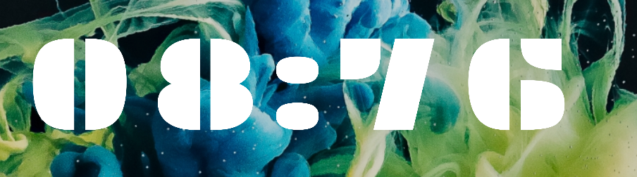
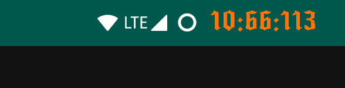
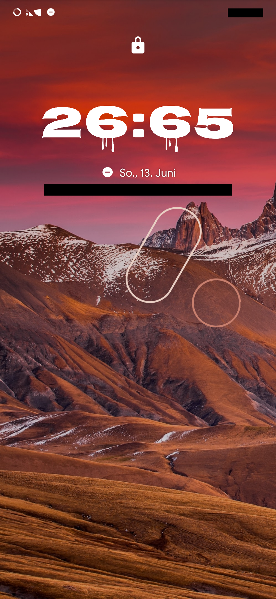
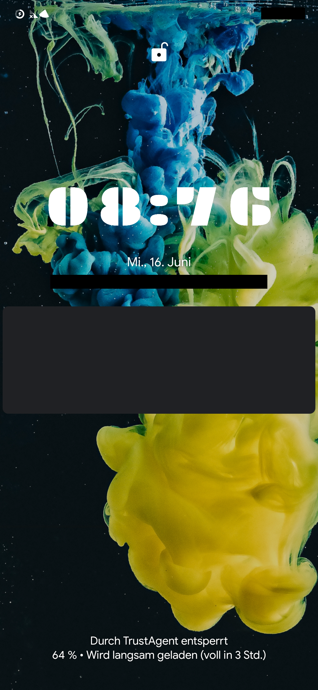
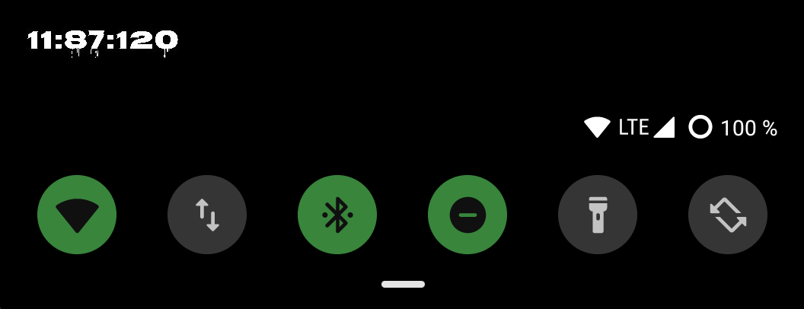
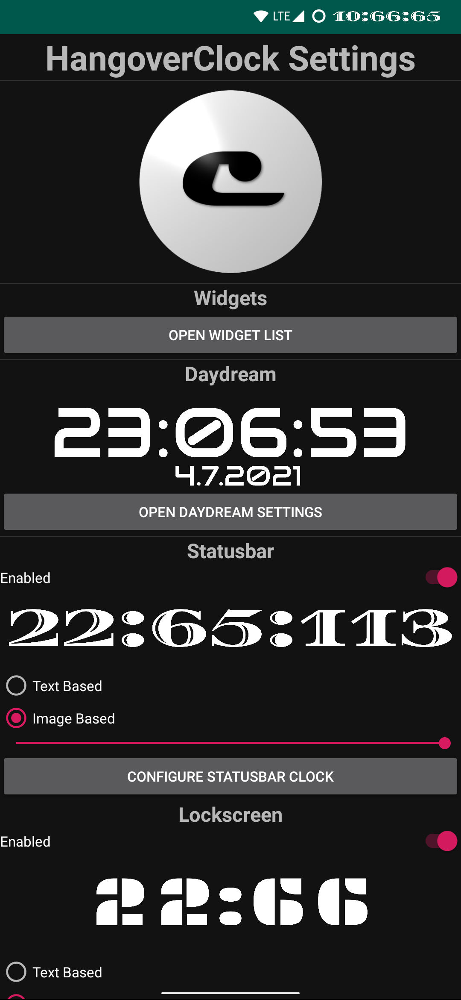
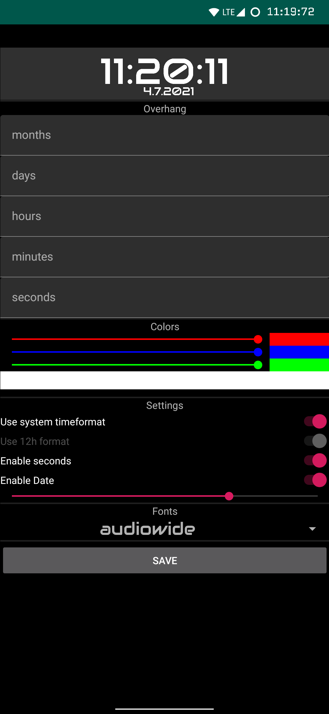
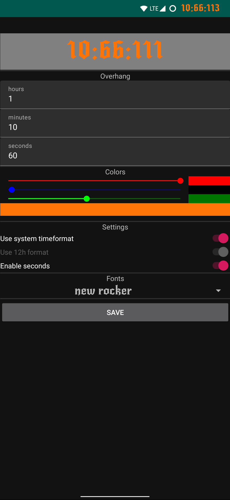

# HangoverClock

Welcome to HangoverClock, the only clock which displays the real time in an unrealistic way!

If you just want to see what the app looks like now, 
please take a look at the [screenshots](#screenshots).

You can 
[download the app from the Google Play Store](https://play.google.com/store/apps/details?id=com.JJ.hangoverclock)
or look at the
[latest stable releases](https://github.com/programminghoch10/HangoverClock/releases).

For Wear OS Users, please look [here](https://github.com/programminghoch10/HangoverClock/tree/weardev).

## Usage

You might have installed the app and noticed you can't open it.

This is correct, there is nothing to be opened.
This app is intended to be used in other ways.

Widgets are small screens with information on your homescreen.
The main functionality of this app is the widget.
Here is how to add the widget to your homescreen:
1. Long press on a free place on your homescreen
1. Select widgets
1. Scroll down to `HangoverClock`
1. Press and hold on the widget
1. Move the widget to a free place on your homescreen
1. As soon as you let go, a configuration screen will open
1. Configure away!
1. When you're done, press the button labelled `Create Widget`
1. The widget will now appear on your homescreen

For further configuration and for editing placed widgets,
you can use the settings activity, which is hidden in the App-Info.
Here is how to open it:
1. Go to the device settings
1. Go to the list of apps installed on your device
1. Select `HangoverClock`
1. Either press on the wheel located next to the name
   or click on `Advanced` and then on `Additional settings in the app`.
1. Configure away!

## What makes HangoverClock special?

It all started with this meme:

"You will meet your girlfriend today at 11" and the clock shows `10:65`.

Its obvious that `10:65` would actually be `11:05`.
I thought this needs to become real.

My first test of this was my [Stopwatch](https://github.com/programminghoch10/Stopwatch).

To describe how many minutes the clock should go over the full hour, I used the word "Overhang". 
An Overhang of `0` would result in the clock being totally normal. 
Any Overhang above `0` would result in the clock counting over `60` until the Overhang is reached, at which point it shows the real time again. 
E.g. With an overhang of `10` the clock would go up to `10:69` and the next minute to `11:10`.
Of course you could also go insane with this setting, which results in ridiculous clocks like `03:384829323?  
_(Yes my friend [@IlijazM](https://github.com/IlijazM) actually did that)_. 

And because of that variable, which makes the clock unique, its named HangoverClock.

&nbsp;

***Special info for 12h users:***

Overhang calculation turns out to be really difficult and confusing in the 12h format.
That's why whole calculation happens in 24h format and then gets later subtracted down,
if the hour is between `12+houroverhang` and `24`.
Try setting houroverhang to `0` or `1` and watch what suits you better.
*This behaviour is only relevant when using the date,* 
so please remember that using the 12h setting may not reflect the real time!
But maybe nobody will notice...

## Storytime

This is how HangoverClock got the way it is now.

### Good old times

This was HangoverClock "[Toxic](https://open.spotify.com/track/6I9VzXrHxO9rA9A5euc8Ak)". 
A simple widget which displayed the time.

You were able to modify the Overhang, by clicking in the middle once. 
Then the current overhang was displayed and you could increase or decrease it by clicking the `+` or `-` button.
Also the text was always the same size, no matter how big the widget was resized too.

So my friends inspired me saying the idea is amazing, but the clocks design sucks. 
So I needed to do something about it.

### Big steps forward

Here is HangoverClock "[Dynamite](https://open.spotify.com/track/2CEgGE6aESpnmtfiZwYlbV)".

Dynamite brings a lot of new features: 
First of there are fonts. Around 20 fonts are just waiting for amazing clock widgets to be created.
With the freely choosable color _(`16.777.216` combinations)_ you can select the most fitting for your background.
And you can enable a date to be shown below the clock, which **also has the ability to overhang**!
Also you can now choose whether to use 12h or 24h time format, or use the system setting.

When creating the widget on your home launcher the app greets you with a settings menu, 
which lets you easily set up the widget as you like it.

Also you are now able to not choose one Overhang, but all 4 seperatly. Those are:
* Minutes
* Hours
* Days
* Months

Same thing as always, 
hours defines how much to go over 12/24h mark, 
days defines how much to go over a month
and months defines how much to go over a year.

[@IlijazM](https://github.com/IlijazM) im expecting you to live in 2017 :)

### The next generation

Now comes HangoverClock "[Se](https://open.spotify.com/track/6isKSUpCXSpVLIPT0HMtny)[ren](https://open.spotify.com/track/7A7W0DmZH0wBd93AdvIs97)[i](https://open.spotify.com/track/3V4pQqxOncTLnSIYD2pDpU)[ty](https://open.spotify.com/track/4x1mZMYf8E239Ug0VeYvzQ)":

Serenity comes with quite some overhauls and extra features.

The biggest new thing is the addition of a daydream/screensaver.
You now have the possibility to use HangoverClock as always on display if your phone is charging or in the dock.

And here are some of the smaller changes:
* The seconds overhang can now be configured 
* 10+ new fonts have been added
* The configure menu now saves your settings

Many performance improvements have been made, such as that the clock now manages numbers up to `2^31` (`‭2.147.483.648‬`) with great efficiency when date is disabled.

### The future is now

This is HangoverClock "[Mikado](https://open.spotify.com/track/5RiDCELjD5wFMEvF9xEDOt)":

In Mikado almost everything has improved.
With the inclusion of material design, 
all configuration activites now look a lot better and are easier to navigate.

Mikado also introduces XPosed support, 
which allows devices with Android 10 or higher and an active XPosed framework to replace the notification bar clock and the lockscreen clock.
Each clock can (obviously) be configured seperatly.

HangoverClock also now has a unified settings activity, 
from which configuring everything is possible.
One can even edit widgets from there.

## License

You can see the current license [here](LICENSE.md).

## Thanks

Thanks to all my friends, who motivated me to do this.

Also thanks to my laptop, which crashed 2 times with literally nothing saved to disk.

&nbsp;

## Screenshots

