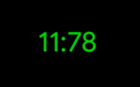
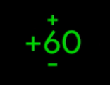
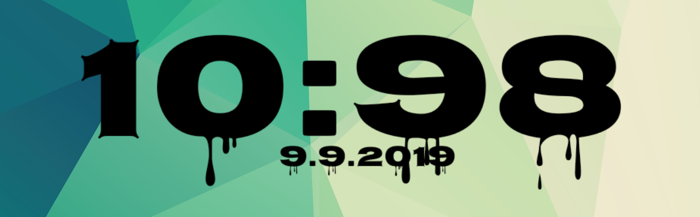
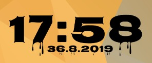
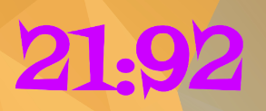
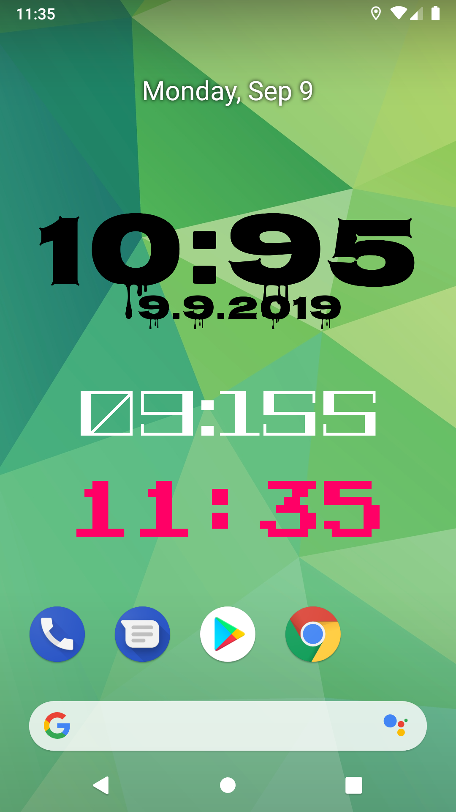
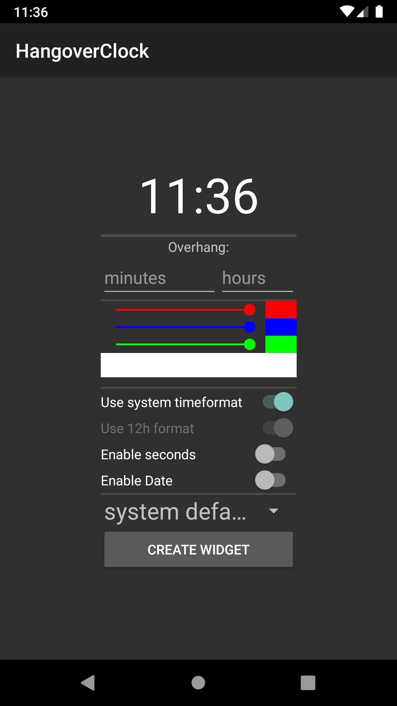
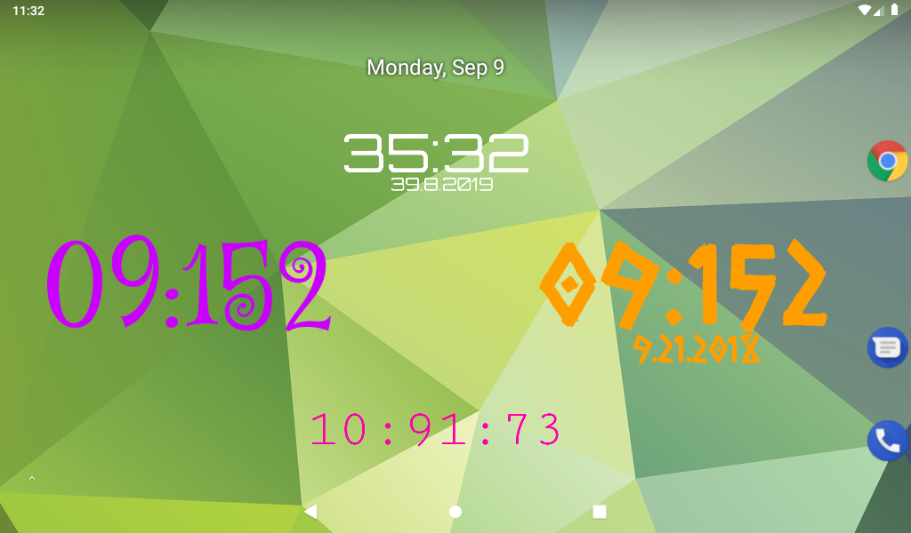

# HangoverClock

Welcome to HangoverClock, the only clock which displays the real time in an unrealistic way!

If you just want to see what this widget looks like now, 
please click [here](https://github.com/programminghoch10/HangoverClock#the-next-generation)

[Download from Play Store](https://play.google.com/store/apps/details?id=com.JJ.hangoverclock)

[Download the newest APK](https://github.com/programminghoch10/HangoverClock/raw/master/app/release/app-release.apk)
or look at the
[latest stable releases](https://github.com/programminghoch10/HangoverClock/releases)

For Wear OS Users, please look [here](https://github.com/programminghoch10/HangoverClock/tree/wear)

## What makes HangoverClock special?

It all started with this meme:

"You will meet your girlfriend today at 11" and the clock shows 10:65.

I thought this needs to get real.
Its obvious that 10:65 would actually be 11:05.

My first test of this was my [Stopwatch](https://github.com/programminghoch10/Stopwatch).

To describe how many minutes the clock should go over the full hour, I used the word "Overhang". 
An Overhang of 0 would result in the clock being totally normal. 
Any Overhang above 0 would result in the clock counting over 60 until the Overhang is reached, at which point it shows the real time again. 
E.g. With an overhang of 10 the clock would go up to 10:69 and the next minute to 11:10.
Of course you could also go insane with this setting, which results in ridiculous clocks like 03:384829323 
(Yes my friend [@IlijazM](https://github.com/IlijazM) actually did that). 

And because of that variable, which makes the clock unique, its named HangoverClock.

## Good old times

This was HangoverClock "Toxic". A simple widget which displayed the time.
You were able to modify the Overhang, by clicking in the middle once. 
Then the current overhang was displayed and you could increase or decrease it by clicking the + or - button.
Also the text was always the same size, no matter how big the widget was resized too.

So my friends inspired me saying the idea is amazing, but the clocks design sucks. So I needed to do something about it.

## The next generation

(background not included)

Here is HangoverClock "Dynamite".

Dynamite brings a lot of new features: 
First of there are fonts. Around 20 fonts (more incoming) are just waiting for amazing clock widgets to be created.
With the freely choosable color (16.777.216 combinations) you can select the most fitting for your background.
And you can enable a date to be shown below the clock, which **also has the ability to overhang**!
Also you can now choose whether to use 12 or 24h time format, or use the system setting.

When creating the widget on your home launcher the app greets you with a settings menu, 
which lets you easily set up the widget as you like it.

Also you are now able to not choose one Overhang, but all 4 seperatly. Those are:
* Minutes
* Hours
* Days
* Months
* _Seconds coming soon (maybe)_

Same thing as always, 
hours defines how much to go over 12/24h mark, 
days defines how much to go over a month
and months defines how much to go over a year.

[@IlijazM](https://github.com/IlijazM) im expecting you to live in 2017 :)

&nbsp;

***Special info for 12h users:***

Overhang calculation turns out to be really difficult and confusing in the 12h format.
That's why whole calculation happens in 24h format and then gets later subtracted down,
if the hour field is between or equal of 12+houroverhang and 24.
Try setting houroverhang to 0 or 1 and watch what suits you better.
*This behaviour is only relevant when using the date,* 
so please remember that using the 12h setting may not reflect the real time!
But maybe nobody will notice...

## The Future

I'm always trying to leave as much options open as possible, but at some point there are too much settings for the user to choose.
Apple already learned that ;) So its probably not getting more customizable in regards to the current features,
but I'm always thinking of new features.
I'm always on the quest to make this the best HangoverClock ever.

## Code Stuff

* All calculations happen inside the Class WidgetGenerator. 
* The only public method is generateWidget, which returns a Bitmap Image.
* The fonts get dynamically collected from all available resource files 
    and saved in a static String array within the ClockWidgetProvider class.
* The sharedPreference keys are defined in preferencekeys.xml and their defaults in preferencekeydefaults.xml.
  * sharedPreferences are saved in the format key and directly appended widget ID.
  * If a key is not defined its default value is assumed and only gets saved when not default or when alwayssavepreferences bool is active.
* if one of the widgets has seconds enabled, the setalarmmanager method will request intent for one second instead of one second.
  * That behaviour is dependent on sharedPreferences key "increaserefreshrate".
  * That key will be determined on every clock update by looping though all widgets and looking if any has seconds enabled.

## Thanksgiving

Thanks to all my friends, who motivated me to do this.
Also thanks to my laptop, which crashed 2 times with literally nothing saved to disk.

&nbsp;

## Screenshots

